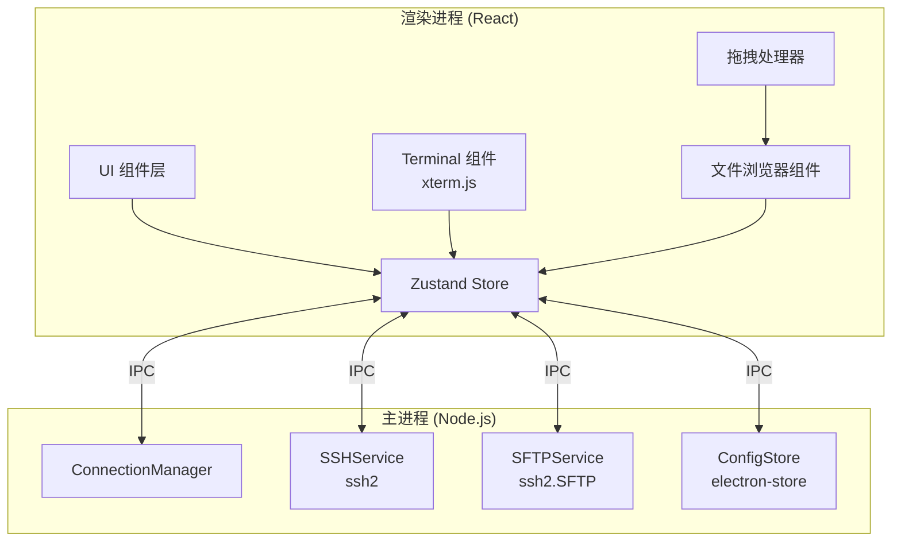
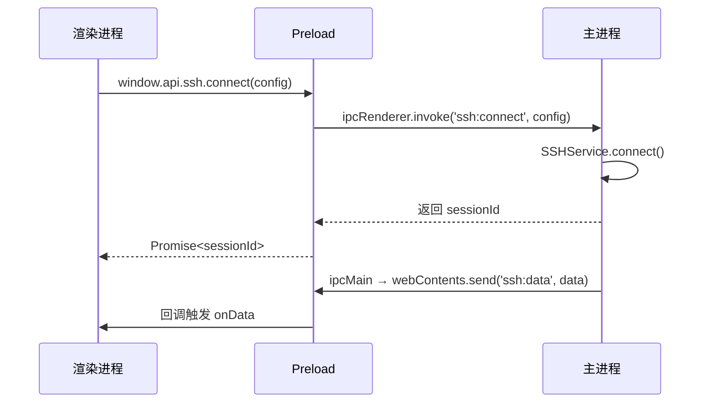
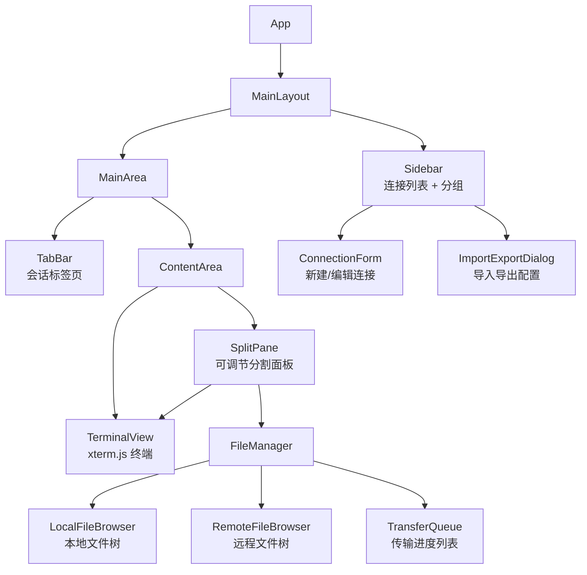

# Design Document: SSH Client App

## Overview

本设计文档描述了一个基于 Electron + React + TypeScript 的现代化 SSH 客户端桌面应用的技术架构。该应用采用成熟的开源库组合：`ssh2` 处理 SSH/SFTP 协议、`xterm.js` 提供终端模拟、React 构建现代化 UI。应用遵循主进程/渲染进程分离的 Electron 架构，通过 IPC 通信确保安全性。

### 技术栈选型

| 层级 | 技术 | 理由 |
|------|------|------|
| 桌面框架 | Electron | 跨平台、成熟生态、原生文件系统访问 |
| 前端框架 | React 18 + TypeScript | 类型安全、组件化、生态丰富 |
| 终端模拟 | xterm.js | 业界标准终端组件，VS Code 同款，GPU 加速渲染 |
| SSH 协议 | ssh2 | 纯 JavaScript SSH2 客户端，支持 SFTP |
| UI 组件库 | Tailwind CSS + Radix UI | 现代化设计系统，无障碍支持 |
| 状态管理 | Zustand | 轻量、TypeScript 友好 |
| 构建工具 | Vite + electron-builder | 快速开发、可靠打包 |
| 测试框架 | Vitest + fast-check | 单元测试 + 属性测试 |

## Architecture



### 进程架构

应用采用 Electron 标准的双进程模型：

- **主进程 (Main Process)**: 运行 Node.js，负责 SSH 连接管理、SFTP 文件传输、配置持久化。所有网络 I/O 和文件系统操作在此执行。
- **渲染进程 (Renderer Process)**: 运行 React 应用，负责 UI 渲染、终端显示、用户交互。通过 `contextBridge` 暴露的安全 API 与主进程通信。
- **Preload 脚本**: 作为桥梁，通过 `contextBridge.exposeInMainWorld` 暴露类型安全的 IPC API。

### IPC 通信模式



## Components and Interfaces

### 1. ConnectionManager（主进程）

负责 Host_Entry 的 CRUD 操作和持久化。

```typescript
interface HostEntry {
  id: string;
  name: string;
  hostname: string;
  port: number;
  username: string;
  authMethod: 'password' | 'publicKey';
  privateKeyPath?: string;
  passphrase?: string;
  group?: string;
  jumpHost?: string;  // 跳板机的 HostEntry id
  keepAliveInterval?: number;  // 秒
  createdAt: string;
  updatedAt: string;
}

interface ConnectionGroup {
  id: string;
  name: string;
  parentId?: string;  // 支持嵌套分组
}

interface ConnectionManager {
  // CRUD
  createHost(entry: Omit<HostEntry, 'id' | 'createdAt' | 'updatedAt'>): HostEntry;
  getHost(id: string): HostEntry | undefined;
  updateHost(id: string, updates: Partial<HostEntry>): HostEntry;
  deleteHost(id: string): void;
  listHosts(): HostEntry[];

  // 分组
  createGroup(name: string, parentId?: string): ConnectionGroup;
  deleteGroup(id: string): void;
  listGroups(): ConnectionGroup[];

  // 导入导出
  exportConfig(): string;  // JSON string
  importConfig(json: string): { imported: number; errors: string[] };
}
```

### 2. SSHService（主进程）

管理 SSH 会话生命周期。

```typescript
interface SSHSession {
  id: string;
  hostEntryId: string;
  status: 'connecting' | 'connected' | 'disconnected' | 'error';
  connectedAt?: string;
  error?: string;
}

interface SSHService {
  connect(hostEntry: HostEntry, password?: string): Promise<SSHSession>;
  disconnect(sessionId: string): void;
  getSession(sessionId: string): SSHSession | undefined;
  listSessions(): SSHSession[];

  // 终端数据流
  write(sessionId: string, data: string): void;
  resize(sessionId: string, cols: number, rows: number): void;
  onData(sessionId: string, callback: (data: string) => void): void;
  onClose(sessionId: string, callback: () => void): void;
}
```

### 3. SFTPService（主进程）

处理 SFTP 文件传输操作。

```typescript
interface FileEntry {
  name: string;
  path: string;
  isDirectory: boolean;
  size: number;
  modifiedAt: string;
  permissions: string;
}

interface TransferProgress {
  transferId: string;
  filename: string;
  direction: 'upload' | 'download';
  bytesTransferred: number;
  totalBytes: number;
  speed: number;  // bytes/sec
  status: 'pending' | 'transferring' | 'completed' | 'failed' | 'cancelled';
  error?: string;
}

interface SFTPService {
  listDirectory(sessionId: string, remotePath: string): Promise<FileEntry[]>;
  upload(sessionId: string, localPath: string, remotePath: string): Promise<TransferProgress>;
  download(sessionId: string, remotePath: string, localPath: string): Promise<TransferProgress>;
  uploadDirectory(sessionId: string, localPath: string, remotePath: string): Promise<TransferProgress[]>;
  downloadDirectory(sessionId: string, remotePath: string, localPath: string): Promise<TransferProgress[]>;
  cancelTransfer(transferId: string): void;
  getTransferProgress(transferId: string): TransferProgress | undefined;
  onProgress(transferId: string, callback: (progress: TransferProgress) => void): void;
}
```

### 4. ConfigStore（主进程）

配置持久化，基于 `electron-store`。

```typescript
interface AppConfig {
  theme: 'dark' | 'light';
  terminal: {
    fontFamily: string;
    fontSize: number;
    colorScheme: string;
  };
  sidebarCollapsed: boolean;
  defaultKeepAlive: number;
}

interface ConfigStore {
  getHosts(): HostEntry[];
  setHosts(hosts: HostEntry[]): void;
  getGroups(): ConnectionGroup[];
  setGroups(groups: ConnectionGroup[]): void;
  getAppConfig(): AppConfig;
  setAppConfig(config: Partial<AppConfig>): void;
}
```

### 5. React 组件结构（渲染进程）



### 6. Preload API（IPC 桥接）

```typescript
interface ElectronAPI {
  ssh: {
    connect(config: HostEntry, password?: string): Promise<SSHSession>;
    disconnect(sessionId: string): Promise<void>;
    write(sessionId: string, data: string): void;
    resize(sessionId: string, cols: number, rows: number): void;
    onData(sessionId: string, callback: (data: string) => void): () => void;
    onClose(sessionId: string, callback: () => void): () => void;
    onError(sessionId: string, callback: (error: string) => void): () => void;
  };
  sftp: {
    listDirectory(sessionId: string, path: string): Promise<FileEntry[]>;
    upload(sessionId: string, localPath: string, remotePath: string): Promise<string>;
    download(sessionId: string, remotePath: string, localPath: string): Promise<string>;
    cancelTransfer(transferId: string): Promise<void>;
    onProgress(callback: (progress: TransferProgress) => void): () => void;
  };
  config: {
    getHosts(): Promise<HostEntry[]>;
    saveHost(entry: HostEntry): Promise<void>;
    deleteHost(id: string): Promise<void>;
    exportConfig(): Promise<string>;
    importConfig(json: string): Promise<{ imported: number; errors: string[] }>;
    getAppConfig(): Promise<AppConfig>;
    setAppConfig(config: Partial<AppConfig>): Promise<void>;
  };
  dialog: {
    selectFile(options?: { directory?: boolean }): Promise<string | null>;
    selectSaveLocation(defaultName: string): Promise<string | null>;
  };
}
```

## Data Models

### HostEntry 序列化格式

连接配置以 JSON 格式存储和导入导出：

```json
{
  "version": "1.0",
  "hosts": [
    {
      "id": "uuid-1",
      "name": "Production Server",
      "hostname": "192.168.1.100",
      "port": 22,
      "username": "admin",
      "authMethod": "publicKey",
      "privateKeyPath": "/home/user/.ssh/id_rsa",
      "group": "group-uuid-1",
      "keepAliveInterval": 60,
      "createdAt": "2024-01-01T00:00:00Z",
      "updatedAt": "2024-01-01T00:00:00Z"
    }
  ],
  "groups": [
    {
      "id": "group-uuid-1",
      "name": "Production",
      "parentId": null
    }
  ]
}
```

### 验证规则

| 字段 | 规则 |
|------|------|
| hostname | 非空，有效的主机名或 IP 地址 |
| port | 1-65535 之间的整数 |
| username | 非空字符串 |
| authMethod | 枚举值：'password' 或 'publicKey' |
| privateKeyPath | 当 authMethod 为 'publicKey' 时必填 |
| keepAliveInterval | 正整数，默认 60 |
| name | 非空字符串 |

### Zustand Store 结构

```typescript
interface AppStore {
  // 连接管理
  hosts: HostEntry[];
  groups: ConnectionGroup[];
  selectedHostId: string | null;

  // 会话管理
  sessions: SSHSession[];
  activeSessionId: string | null;

  // 文件传输
  transfers: TransferProgress[];

  // UI 状态
  theme: 'dark' | 'light';
  sidebarCollapsed: boolean;
  splitPaneVisible: boolean;
  splitPaneRatio: number;

  // Actions
  loadHosts(): Promise<void>;
  addHost(entry: Omit<HostEntry, 'id' | 'createdAt' | 'updatedAt'>): Promise<void>;
  updateHost(id: string, updates: Partial<HostEntry>): Promise<void>;
  removeHost(id: string): Promise<void>;
  connectToHost(id: string, password?: string): Promise<void>;
  disconnectSession(sessionId: string): Promise<void>;
  setActiveSession(sessionId: string): void;
  toggleTheme(): void;
  toggleSidebar(): void;
}
```


## Correctness Properties

*A property is a characteristic or behavior that should hold true across all valid executions of a system — essentially, a formal statement about what the system should do. Properties serve as the bridge between human-readable specifications and machine-verifiable correctness guarantees.*

以下属性基于需求文档中的验收标准推导而来，经过冗余分析合并后保留了具有独立验证价值的属性。

### Property 1: Host entry create-then-retrieve

*For any* valid HostEntry data (valid hostname, port in 1-65535, non-empty username, valid authMethod), creating a host entry and then retrieving it by ID should return an entry with all the same field values.

**Validates: Requirements 1.1, 1.2, 1.6**

### Property 2: Host entry update preserves unchanged fields

*For any* existing HostEntry and any partial update, after applying the update, all fields not included in the update should retain their original values, and all fields included in the update should reflect the new values.

**Validates: Requirements 1.3**

### Property 3: Host entry deletion reduces list

*For any* list of host entries and any entry in that list, deleting the entry should result in the list length decreasing by one, and the deleted entry should no longer be retrievable by ID.

**Validates: Requirements 1.4**

### Property 4: Host grouping consistency

*For any* set of host entries and groups, assigning a host to a group should result in that host's group field matching the group ID, and listing hosts by group should include that host.

**Validates: Requirements 1.5**

### Property 5: Session tab tracking

*For any* number of active SSH sessions, the tab list should contain exactly one tab per session, and each tab should reference a valid session ID.

**Validates: Requirements 3.2**

### Property 6: Transfer progress calculation

*For any* transfer with known totalBytes > 0 and bytesTransferred in [0, totalBytes], the calculated percentage should equal (bytesTransferred / totalBytes) * 100, and the percentage should always be in the range [0, 100].

**Validates: Requirements 4.5**

### Property 7: Transfer queue management

*For any* set of file transfer requests (from drag-drop or manual initiation), all files should appear in the transfer queue, and the queue length should equal the number of requested transfers.

**Validates: Requirements 4.7, 5.5**

### Property 8: Recursive directory traversal completeness

*For any* directory tree structure, the recursive traversal should produce a flat list containing every file in the tree, and the count of files in the flat list should equal the total number of files across all subdirectories.

**Validates: Requirements 4.8**

### Property 9: File conflict detection

*For any* list of files to transfer and any target directory listing, the conflict detection function should identify exactly those files whose names appear in both the source list and the target listing.

**Validates: Requirements 5.6**

### Property 10: Configuration serialization round-trip

*For any* valid set of HostEntry objects and ConnectionGroup objects, serializing to JSON and then deserializing should produce an equivalent set of objects (deep equality).

**Validates: Requirements 7.3**

### Property 11: Invalid import graceful handling

*For any* JSON string containing a mix of valid and invalid HostEntry objects, importing should successfully add all valid entries and return specific error messages for each invalid entry, without the invalid entries affecting the valid ones.

**Validates: Requirements 7.4**

## Error Handling

### SSH 连接错误

| 错误场景 | 处理方式 |
|----------|----------|
| 连接超时 | 30 秒后终止连接尝试，显示超时错误，提供重试选项 |
| 认证失败 | 显示具体失败原因（密码错误、密钥无效等），允许重新输入凭据 |
| 连接断开 | 检测到断开后立即通知用户，提供一键重连按钮 |
| 跳板机连接失败 | 分别报告跳板机和目标服务器的连接状态 |
| 主机密钥验证失败 | 显示主机指纹，让用户确认是否信任 |

### SFTP 传输错误

| 错误场景 | 处理方式 |
|----------|----------|
| 传输中断 | 标记传输为失败状态，提供重试选项 |
| 权限不足 | 显示权限错误信息，建议检查远程目录权限 |
| 磁盘空间不足 | 检测到空间不足时提前终止传输并通知用户 |
| 文件名冲突 | 弹出对话框提供覆盖、重命名、跳过三个选项 |
| 目录不存在 | 提示用户是否自动创建目标目录 |

### 配置错误

| 错误场景 | 处理方式 |
|----------|----------|
| 导入文件格式错误 | 解析 JSON 失败时显示格式错误信息 |
| 导入数据验证失败 | 跳过无效条目，导入有效条目，汇总报告错误 |
| 配置文件损坏 | 检测到损坏时使用默认配置，提示用户 |
| 私钥文件不存在 | 连接时检测并提示用户重新选择密钥文件 |

### 全局错误处理策略

- 所有 IPC 调用使用 try-catch 包装，错误通过 IPC 返回渲染进程
- 渲染进程使用全局 Toast 通知系统显示错误
- 关键错误（如配置损坏）使用模态对话框
- 所有错误记录到应用日志文件，便于排查

## Testing Strategy

### 测试框架

- **单元测试**: Vitest — 快速、TypeScript 原生支持、与 Vite 集成
- **属性测试**: fast-check — JavaScript/TypeScript 生态中最成熟的属性测试库
- **组件测试**: React Testing Library — 测试 React 组件行为
- **E2E 测试**: Playwright — 测试 Electron 应用端到端流程（手动执行）

### 双重测试策略

#### 属性测试（Property-Based Tests）

属性测试验证在所有有效输入上都成立的通用属性。每个属性测试：
- 最少运行 100 次迭代
- 使用 fast-check 生成随机输入
- 标注对应的设计文档属性编号
- 标签格式: **Feature: ssh-client-app, Property {number}: {property_text}**

每个正确性属性必须由一个单独的属性测试实现。

#### 单元测试（Unit Tests）

单元测试聚焦于：
- 具体的示例和边界情况（如空字符串、极端端口号）
- 错误条件（如无效 JSON 导入、认证失败错误消息）
- 组件间集成点
- 不适合属性测试的 UI 交互逻辑

### 测试覆盖矩阵

| 组件 | 属性测试 | 单元测试 |
|------|----------|----------|
| ConnectionManager | Property 1-4, 10-11 | CRUD 边界情况、验证规则 |
| SSHService | — | 错误消息生成、会话状态转换 |
| SFTPService | Property 6-9 | 传输状态转换、错误处理 |
| Terminal 状态管理 | Property 5 | 标签切换、配置应用 |
| Drag-Drop 处理 | — | 拖拽事件映射、方向判断 |
| 配置序列化 | Property 10-11 | JSON 格式验证、版本兼容 |

### 测试文件组织

```
src/
├── main/
│   ├── services/
│   │   ├── __tests__/
│   │   │   ├── connection-manager.test.ts      # 单元测试
│   │   │   ├── connection-manager.property.test.ts  # 属性测试
│   │   │   ├── sftp-service.test.ts
│   │   │   ├── sftp-service.property.test.ts
│   │   │   └── config-store.test.ts
│   │   └── ...
├── renderer/
│   ├── components/
│   │   ├── __tests__/
│   │   │   ├── file-browser.test.tsx
│   │   │   └── transfer-queue.test.tsx
│   │   └── ...
│   └── store/
│       └── __tests__/
│           ├── app-store.test.ts
│           └── app-store.property.test.ts
```
