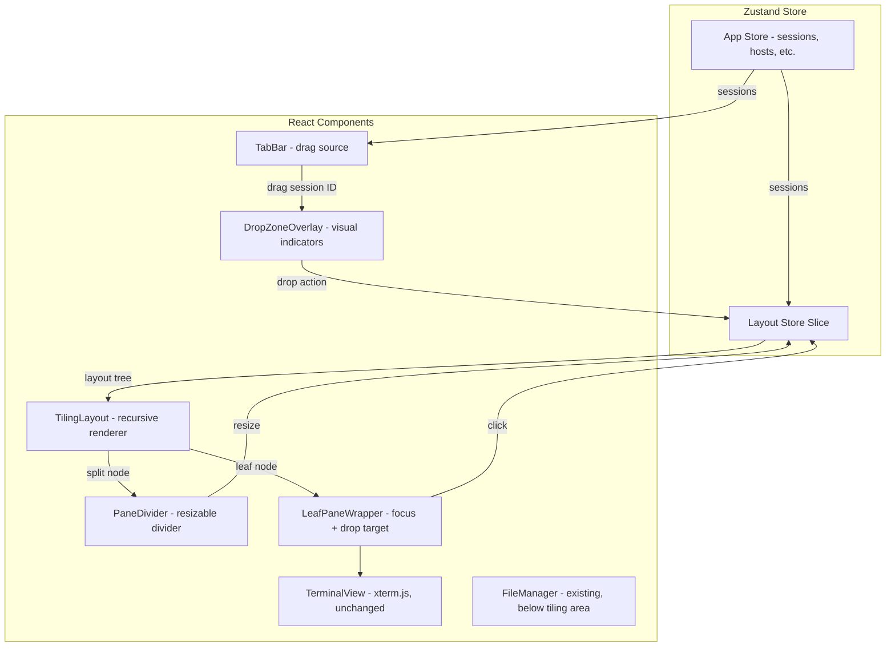

# Design Document: Terminal Tab Drag-to-Split Layout

## Overview

This design introduces a recursive binary split tree layout system to the SSH client app, replacing the current single-active-terminal model. The core idea is a `LayoutTree` data structure where each node is either a `LeafPane` (rendering a terminal) or a `SplitNode` (dividing space between two children). Users create splits by dragging tabs onto drop zones, and the tree collapses automatically when panes are closed.

The implementation lives entirely in the renderer process. A new Zustand store slice manages the layout tree, and a new `TilingLayout` component recursively renders it. The existing `TerminalView` and its caching mechanism remain unchanged — each `LeafPane` simply mounts a `TerminalView` with the appropriate session ID.

## Architecture



The layout store is a separate Zustand slice (or integrated into the existing `AppStore`) that owns the `LayoutTree`. All layout mutations (split, close, resize, set active) go through store actions, keeping the tree immutable from the component perspective.

## Components and Interfaces

### 1. Layout Tree Types (`src/shared/types.ts`)

```typescript
// Discriminated union for the layout tree
export type LayoutNode = LeafPane | SplitNode;

export interface LeafPane {
  type: 'leaf';
  paneId: string;
  sessionId: string;
}

export interface SplitNode {
  type: 'split';
  direction: 'horizontal' | 'vertical'; // horizontal = left/right, vertical = top/bottom
  ratio: number; // 0.2 to 0.8
  first: LayoutNode;
  second: LayoutNode;
}

export type DropPosition = 'left' | 'right' | 'top' | 'bottom' | 'center';
```

### 2. Layout Store Slice (`src/renderer/store/layout-store.ts`)

New state and actions added to the Zustand store:

```typescript
export interface LayoutStoreSlice {
  // State
  layoutTree: LayoutNode | null;
  activePaneId: string | null;

  // Actions
  initLayout: (sessionId: string) => void;
  splitPane: (targetPaneId: string, sessionId: string, position: DropPosition) => void;
  closePane: (paneId: string) => void;
  resizeSplit: (splitPath: number[], ratio: number) => void;
  setActivePaneId: (paneId: string) => void;
  findPaneBySessionId: (sessionId: string) => LeafPane | null;
  replaceSessionInPane: (paneId: string, newSessionId: string) => void;
}
```

Key implementation details:

- `splitPane`: Finds the target `LeafPane` by `paneId`, replaces it with a new `SplitNode` containing the original pane and a new pane for the dragged session. The position determines direction and child order.
- `closePane`: Finds the `LeafPane`, removes it, and replaces the parent `SplitNode` with the sibling. If it's the last pane, sets `layoutTree` to `null`.
- `resizeSplit`: Navigates the tree using a path (array of 0/1 indices for first/second child) and updates the ratio, clamped to [0.2, 0.8].
- `initLayout`: Creates a single `LeafPane` when the first session connects and the tree is null.

### 3. TilingLayout Component (`src/renderer/components/TilingLayout.tsx`)

Recursive React component that renders the `LayoutTree`:

```typescript
interface TilingLayoutProps {
  node: LayoutNode;
  path: number[]; // path from root, used for resize identification
}
```

- For `LeafPane`: renders `LeafPaneWrapper` which contains `TerminalView` + drop zone overlay + focus border.
- For `SplitNode`: renders two `TilingLayout` children with a `PaneDivider` between them, using CSS flexbox with the split ratio.

### 4. LeafPaneWrapper Component (`src/renderer/components/LeafPaneWrapper.tsx`)

Wraps a single terminal pane with:
- Click handler to set active pane
- Drop zone overlay (shown during drag)
- Active pane border highlight
- Mounts `TerminalView` with the pane's session ID

### 5. DropZoneOverlay Component (`src/renderer/components/DropZoneOverlay.tsx`)

Shown inside `LeafPaneWrapper` during a tab drag:
- Divides the pane area into 5 zones: left (25%), right (25%), top (25%), bottom (25%), center (50%)
- Highlights the zone under the cursor
- On drop, calls `layoutStore.splitPane(paneId, sessionId, position)`

### 6. PaneDivider Component (`src/renderer/components/PaneDivider.tsx`)

A thin draggable bar between split children:
- Horizontal splits: vertical bar, `cursor: col-resize`
- Vertical splits: horizontal bar, `cursor: row-resize`
- On drag, computes new ratio from mouse position relative to parent bounds
- Calls `layoutStore.resizeSplit(path, newRatio)`

### 7. TabBar Changes (`src/renderer/components/TabBar.tsx`)

Minimal changes to existing TabBar:
- Add `draggable` attribute and `onDragStart` to each tab element
- Set drag data to the session ID via `dataTransfer.setData('text/session-id', sessionId)`
- Existing click-to-switch behavior remains, now also sets the active pane

### 8. App.tsx Changes

- Replace the single `TerminalView` rendering with `TilingLayout` rendering the `layoutTree`
- When `layoutTree` is null, show the welcome screen
- The file manager split (top: tiling area, bottom: file manager) remains as-is, with the tiling layout occupying the terminal portion

## Data Models

### Layout Tree Serialization

The `LayoutNode` discriminated union serializes naturally to JSON:

```json
{
  "type": "split",
  "direction": "horizontal",
  "ratio": 0.5,
  "first": {
    "type": "leaf",
    "paneId": "pane-1",
    "sessionId": "session-abc"
  },
  "second": {
    "type": "split",
    "direction": "vertical",
    "ratio": 0.6,
    "first": { "type": "leaf", "paneId": "pane-2", "sessionId": "session-def" },
    "second": { "type": "leaf", "paneId": "pane-3", "sessionId": "session-ghi" }
  }
}
```

### Tree Invariants

1. Every `SplitNode` has exactly two non-null children.
2. Every `LeafPane` has a unique `paneId`.
3. Every `ratio` is in [0.2, 0.8].
4. The tree has no `SplitNode` with both children being the same `LeafPane`.
5. Session IDs in the tree are a subset of active sessions in the app store.

### Layout Store Integration with App Store

The layout store is integrated into the existing `AppStore` via Zustand. When a session connects, if `layoutTree` is null, `initLayout` creates a root `LeafPane`. When a session disconnects, `closePane` is called for any pane holding that session. The `activeSessionId` in the app store is kept in sync with the `activePaneId` — when the active pane changes, the app store's `activeSessionId` updates to match.


## Correctness Properties

*A property is a characteristic or behavior that should hold true across all valid executions of a system — essentially, a formal statement about what the system should do. Properties serve as the bridge between human-readable specifications and machine-verifiable correctness guarantees.*

### Property 1: Tree structure invariant

*For any* valid `LayoutNode` tree, every node is either a `LeafPane` with a non-empty `paneId` and `sessionId`, or a `SplitNode` with a valid `direction`, a `ratio` in [0.2, 0.8], and exactly two non-null children.

**Validates: Requirements 1.1**

### Property 2: Serialization round-trip

*For any* valid `LayoutNode` tree, serializing it to JSON and then deserializing it back produces a tree that is deeply equal to the original.

**Validates: Requirements 1.2**

### Property 3: Ratio clamping invariant

*For any* `LayoutNode` tree and any mutation (split, resize, or close), every `SplitNode.ratio` in the resulting tree is between 0.2 and 0.8 inclusive.

**Validates: Requirements 1.3, 4.2**

### Property 4: Split direction matches drop position

*For any* valid `LayoutNode` tree, any leaf pane in that tree, and any non-center drop position, calling `splitPane` produces a new `SplitNode` where: the direction is "horizontal" if the drop position is "left" or "right", the direction is "vertical" if the drop position is "top" or "bottom", and the default ratio is 0.5.

**Validates: Requirements 2.3, 2.4, 2.6**

### Property 5: Center drop replaces session

*For any* valid `LayoutNode` tree and any leaf pane in that tree, dropping a session on the "center" position replaces that pane's session ID with the new session ID without changing the tree structure (same number of nodes, same split directions and ratios).

**Validates: Requirements 2.5**

### Property 6: Resize updates only the target split

*For any* valid `LayoutNode` tree containing at least one `SplitNode`, calling `resizeSplit` with a valid path and a new ratio updates only the ratio of the targeted `SplitNode` and leaves all other nodes unchanged.

**Validates: Requirements 4.1**

### Property 7: Close pane collapses parent split

*For any* valid `LayoutNode` tree with at least two leaf panes, closing a leaf pane that is a direct child of a `SplitNode` replaces that `SplitNode` with the sibling child, reducing the total leaf count by exactly one.

**Validates: Requirements 5.1**

### Property 8: New session adds leaf to tree

*For any* valid `LayoutNode` tree (or null tree) and a new session ID, adding the session to the layout results in a tree that contains a `LeafPane` with that session ID, and the total leaf count increases by one (or becomes one if the tree was null).

**Validates: Requirements 7.1**

### Property 9: Find pane by session ID

*For any* valid `LayoutNode` tree and any session ID that exists in a leaf of that tree, `findPaneBySessionId` returns the `LeafPane` whose `sessionId` matches, and for any session ID not present in the tree, it returns null.

**Validates: Requirements 7.3**

## Error Handling

### Invalid Drop Operations
- If a tab is dropped outside any valid drop zone, the operation is silently ignored (no layout change).
- If a tab carrying a session ID that is already visible in the target pane is dropped on "center", no change occurs (idempotent).

### Tree Corruption Recovery
- If the layout tree enters an invalid state (e.g., a `SplitNode` with a null child due to a bug), the store should detect this and reset to a single-pane layout with the first available session, logging a warning.

### Resize Edge Cases
- If `resizeSplit` is called with an invalid path (path doesn't lead to a `SplitNode`), the operation is silently ignored.
- Ratio values outside [0.2, 0.8] are clamped, never rejected.

### Session Lifecycle
- If a session disconnects while its pane is visible, the pane shows the terminal's "[Connection closed]" message (existing behavior from `TerminalView`). The pane remains until explicitly closed by the user.
- If `closePane` is called for a `paneId` that doesn't exist in the tree, the operation is silently ignored.

### Terminal Cache Consistency
- When a pane is closed, `disposeTerminal(sessionId)` is called only if no other pane in the tree references the same session ID (defensive check, though the UI shouldn't allow duplicate session panes).

## Testing Strategy

### Property-Based Testing

Library: `fast-check` (already installed in the project)

Each correctness property will be implemented as a single property-based test using `fast-check`. Tests will generate random valid `LayoutNode` trees using custom arbitraries and verify the property holds across at least 100 iterations.

Custom arbitraries needed:
- `arbLeafPane`: generates a `LeafPane` with random `paneId` and `sessionId`
- `arbLayoutNode(depth)`: recursively generates a `LayoutNode` tree up to a given depth, with random split directions and ratios
- `arbDropPosition`: generates one of `'left' | 'right' | 'top' | 'bottom' | 'center'`
- `arbRatio`: generates a number in [0.0, 1.0] (to test clamping) or [0.2, 0.8] (for valid trees)

Each test will be tagged with a comment referencing the design property:
```
// Feature: terminal-tab-drag-split, Property N: <property title>
```

Configuration: minimum 100 iterations per property test (`{ numRuns: 100 }`).

### Unit Testing

Unit tests complement property tests by covering:
- Specific examples: a known tree structure, a specific split operation, verifying the exact result
- Edge cases: closing the last pane (tree becomes null), splitting a single-leaf tree, resizing at boundary values (0.2, 0.8)
- Integration points: verifying that `activeSessionId` in the app store syncs with `activePaneId` in the layout store
- DOM/rendering: basic React component rendering tests for `TilingLayout`, `DropZoneOverlay`, and `PaneDivider` using React Testing Library

### Test File Organization

- `src/renderer/store/__tests__/layout-store.property.test.ts` — property-based tests for all 9 properties
- `src/renderer/store/__tests__/layout-store.test.ts` — unit tests for store actions
- `src/renderer/components/__tests__/TilingLayout.test.tsx` — component rendering tests
